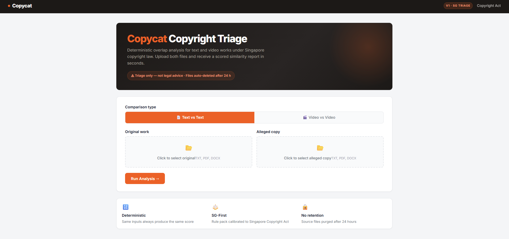
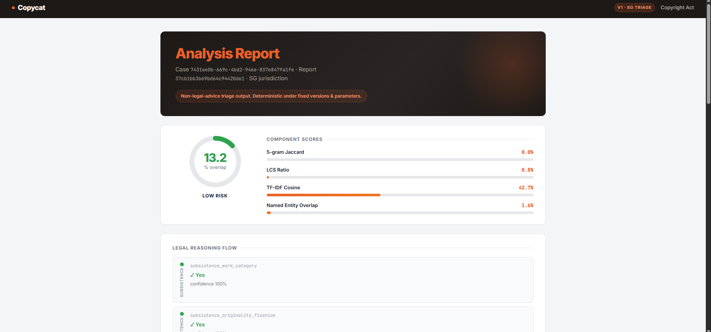

# Copycat

**Singapore-first copyright infringement triage tool** with deterministic similarity scoring.

> ⚠ Triage only. Not legal advice. Source files are auto-deleted after 24 hours.

---

---

## Stack

| Layer | Technology |
|-------|-----------|
| Frontend | Next.js 14 (TypeScript) |
| API | FastAPI + Uvicorn |
| Worker | Celery (eager mode by default; Redis for distributed) |
| Database | SQLite (dev) / PostgreSQL-ready via SQLAlchemy |
| Storage | Local filesystem (dev) / S3-compatible abstraction |
| Reports | ReportLab PDF |

---

## Screenshots

**Triage UI — upload form**



**Analysis run — terminal output**



---

## Quick start (Docker)

```bash
docker compose up --build
```

- API docs: http://localhost:8000/docs  
- Frontend: http://localhost:3000

---

## Local setup (shell scripts)

```bash
# 1. First-time setup (creates virtualenv, installs deps)
bash setup.sh

# 2a. Start everything at once
bash start.sh

# 2b. Or start services individually
bash start_backend.sh    # FastAPI on :8000
bash start_frontend.sh   # Next.js on :3000
```

> **Windows users:** use Git Bash, WSL2, or the Docker path above.

### Manual setup

```bash
# Backend
cd backend
python3.11 -m venv .venv
source .venv/bin/activate          # Windows: .venv\Scripts\activate
pip install -r requirements.txt
# Optional video/ML extras:
# pip install -r requirements-video.txt
uvicorn app.main:app --reload --port 8000

# Frontend (separate shell)
cd frontend
npm install
npm run dev
```

### Optional Celery worker (distributed mode)

```bash
# Requires Redis running on localhost:6379
cd backend
celery -A app.celery_app.celery_app worker --loglevel=info
```

---

## Similarity Metrics

Copycat produces a **headline overlap percentage** (0–100 %) from a weighted combination of component metrics. All calculations are deterministic: identical inputs always yield identical scores.

### Text Similarity

Four metrics are computed on normalised, tokenised text (punctuation stripped, lowercased):

| ID | Name | Weight | Description |
|----|------|--------|-------------|
| **M1** | 5-gram Jaccard | 35 % | Jaccard similarity of all contiguous 5-token n-grams between the two documents. Highly sensitive to verbatim copying of short phrases. Range [0, 1]. |
| **M2** | LCS Ratio | 25 % | Length of the Longest Common Subsequence (LCS) divided by the length of the longer document (in tokens). Captures structural ordering similarity even when exact phrases are paraphrased. Range [0, 1]. |
| **M3** | TF-IDF Cosine | 30 % | Cosine similarity of TF-IDF weighted unigram+bigram vectors. Downweights common words and amplifies rare shared terms. Range [0, 1]. |
| **M4** | Named Entity Overlap | 10 % | Jaccard overlap of named entities (proper nouns, acronyms, 4-digit years) extracted via regex. Catches identical references to real-world entities. Range [0, 1]. |

**Headline formula:**

```
score = 0.35 × M1 + 0.25 × M2 + 0.30 × M3 + 0.10 × M4
```

The report also returns up to 50 **matched passages** — verbatim 12-token windows that appear in both documents — as evidence snippets.

---

### Video Similarity

Four metrics are computed over sampled frames and optional transcripts:

| ID | Name | Weight | Description |
|----|------|--------|-------------|
| **V1** | Frame pHash Alignment | 50 % | Perceptual hash (pHash) Hamming similarity averaged over monotonically aligned frame pairs, multiplied by temporal coverage. The monotonic alignment uses an 8-frame lookahead and a 0.55 similarity threshold to find matching frame sequences in presentation order. |
| **V2** | SSIM | 20 % | Structural Similarity Index (SSIM) averaged over the same aligned frame pairs. Measures luminance, contrast, and structural differences at the pixel level. Requires `opencv` + `scikit-image` extras. |
| **V3** | PSNR (supporting) | — | Peak Signal-to-Noise Ratio, normalised to [0, 1] by dividing by 50 dB. Reported as a diagnostic metric but **not included** in the headline formula. |
| **V4** | Transcript Similarity | 30 % | Full text-similarity pipeline (M1–M4 composite) applied to Whisper-generated transcripts of both videos. Falls back to 0 if neither video has a transcript. |

**Headline formula:**

```
score = 0.50 × V1 + 0.20 × V2 + 0.30 × V4
```

> V2 and V3 are only computed when `opencv-python-headless` and `scikit-image` are installed (`requirements-video.txt`). V4 requires `openai-whisper`.

---

## Risk Bands

| Band | Headline overlap | Interpretation |
|------|-----------------|----------------|
| **LOW** | < 30 % | Minimal detectable overlap |
| **MEDIUM** | 30 – 70 % | Substantial overlap — further review warranted |
| **HIGH** | > 70 % | High overlap — legal assessment strongly recommended |

Risk band thresholds are defined in the active rule pack (`backend/app/rulepacks/sg_v1.json`).

---

## Determinism Guarantee

Each report is assigned a SHA-256-derived `report_id` computed from:

- `case_id`
- `scoring_version`
- `rule_pack_version`
- sorted SHA-256 checksums of all uploaded artifacts

The same case files, same rule pack, and same software version always produce the **exact same report ID and scores**. This supports reproducibility and audit trails.

---

## Notes

- v1 is **triage only**. It is not legal advice.
- Rules are calibrated to the **Singapore Copyright Act 2021**.
- Uploaded source files are retained for **24 hours** by default (`RETENTION_HOURS` env var).
