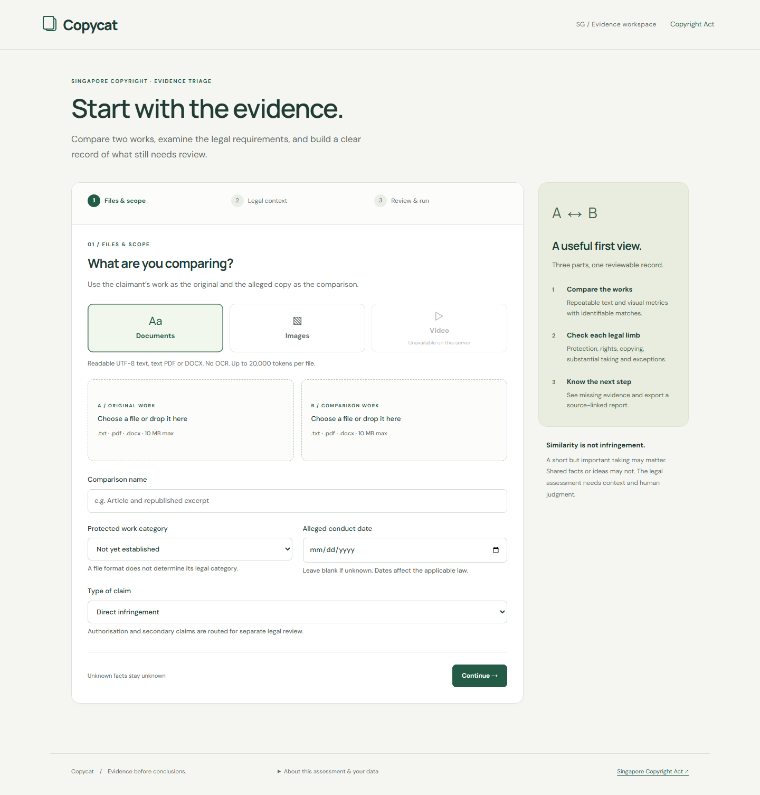

# Copycat

An evidence-led Singapore copyright triage workspace. Compare two works, record
the legal context, inspect deterministic matches and export a reviewable report.



## What changed in v2

- Thirteen evidence-backed questions cover subsistence, qualification, term,
  standing, restricted acts, territory, permission, copying, protected expression,
  substantial taking, independent creation, fair use and other exceptions.
- Missing facts stay unknown. Similarity never establishes access, ownership,
  copying or substantiality. Legal results describe the **supplied assessments**.
- The fair-use worksheet records all four s 191 factors and s 192 acknowledgment
  conditions. Other claims and historical dates are explicitly routed for review.
- Text matching handles short documents, Unicode tokens, repeated text and small
  excerpts without inventing overlap. DOCX tables are included. Unreadable PDFs fail.
- Image and visual-only video comparisons report their methods and limits.
  Missing dependencies disable those options instead of returning false zero scores.
- Case-scoped access keys protect files, jobs, previews and exports. Case inputs
  cannot change during analysis; edits invalidate old reports. Expiry and deletion
  cover originals, derivatives, database evidence and PDFs.
- A responsive, keyboard-accessible workflow supports review, reruns, session
  recovery, image previews, passage locations, PDF and JSON exports.

## Run locally

Use Python 3.11 and Node 22 or newer. Run one local API process (without reload
for persistent work). From the repository root:

```powershell
# Windows / PowerShell
py -3.11 -m venv backend/.venv
backend/.venv/Scripts/python -m pip install --upgrade pip setuptools
backend/.venv/Scripts/python -m pip install -r backend/requirements.txt -r backend/requirements-image.txt
cd backend
.venv/Scripts/python -m uvicorn app.main:app --port 8000
```

In another terminal:

```powershell
cd frontend
npm ci
npm run dev
```

Open [localhost:3000](http://localhost:3000). API documentation is at
[localhost:8000/docs](http://localhost:8000/docs). On Linux/macOS, use
`python3.11 -m venv backend/.venv` and `.venv/bin/python`.

Video requires FFmpeg and ffprobe on PATH, or the `COPYCAT_FFMPEG_BIN` and
`COPYCAT_FFPROBE_BIN` settings. The UI reads server capabilities. It does not use
Whisper, OCR or an external AI service. Text comparison is lexical, not semantic
or cross-language matching. See [configuration](.env.example).

### Containers

```sh
docker compose up --build
```

The compose configuration binds the UI and API to localhost, uses a persistent
named volume and includes FFmpeg/image dependencies. Production UI builds embed
the API URL; change that build argument and CORS origins together for another host.
See the [operations runbook](docs/ops/runbook.md) before exposing the service.

## Workflow

1. Select matching media types, upload original/comparison files and identify the
   work category, alleged conduct date and claim route.
2. Record yes/no/unknown legal assessments. Yes/no needs evidence and reasoning.
   Unknown is valid for an initial comparison.
3. Run analysis. The case page resumes polling after reload in the same tab.
4. Inspect legal gaps and matches. Revise context and rerun as evidence develops.
5. Download PDF/JSON before expiry. Save the access key if you need to reopen in
   another tab. Anyone with that key can read or delete the case.

The retention default is 24 hours from case creation. Access expires at that
time. Physical cleanup runs every five minutes while the service is active,
after running work finishes. Operators must separately govern backups.

## Legal foundation and limits

The [Singapore framework](docs/legal/sg-framework-v2.md) explains the legal limbs,
primary sources, version findings and verification limits. Core provisions include
Copyright Act 2021 ss 39, 109–116, 123–125, 133–146, 152–159 and 190–194.
The rulepack corrects the baseline's misidentified RecordTV citation.

This product records human assessments of evaluative legal requirements. It does
not decide disputed facts, balance fair use automatically, certify infringement,
or assess criminal liability/remedies. Authorisation, secondary infringement,
other work categories and conduct outside the reviewed consolidation period need
separate review. Statutory source bytes and version markers were checked; the
automated provision/quotation extraction package is incomplete and is not claimed
as verified. Foreign-country regulations and historical amendment impacts are
case-specific review items.

## Reproducibility

Reports include role-bound file hashes, full intake, component scores, evidence,
dependency versions, rulepack content hash and scoring version. The report SHA-256
excludes case ID and generation time and includes the substantive inputs/results.
PDF bytes include presentation metadata; the JSON fingerprint identifies the
assessment. See [scoring](docs/scoring/deterministic-scoring-spec.md).

## Verify

```sh
cd backend
python -m pytest -q
cd ../frontend
npm ci
npm run build
npx playwright install chromium
npm test
npm audit
```

Activate the backend venv or use its Python executable. Playwright starts a real
API and UI on ports 8000/3000; stop other copies first. Browser tests exercise
intake, analysis, evidence, revision, exports, access isolation, deletion, mobile
layout and axe accessibility checks. GitHub Actions runs backend, frontend and
browser checks. Validation and remaining release conditions are recorded in
[the improvement audit](docs/IMPROVEMENT-AUDIT.md).
