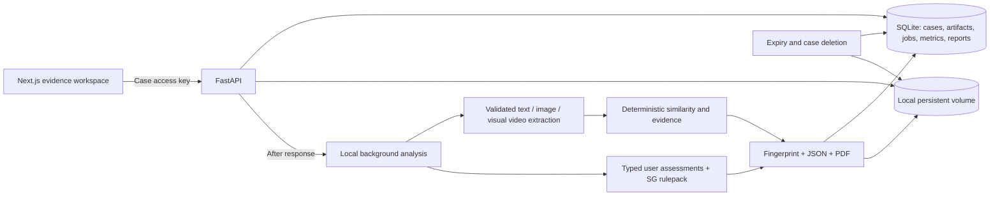

# System design — v2

The supported default is one API process with local background tasks and local
storage. Celery/Redis dispatch is optional and needs deployment-specific
validation; S3 and account-based multi-tenant identity are not implemented.

## Invariants

- Every private route checks a case-scoped secret; the database stores its hash.
- Uploads authenticate before multipart parsing. Declared and streamed body
  sizes are bounded, and actual format and media limits are checked.
- Atomic case-state transitions reject concurrent analysis/mutation. Running
  inputs are immutable. Global capacity is a best-effort admission guard.
- Context/file edits invalidate both JSON and PDF. Case state must be completed
  before a report can be read.
- Unknown assessments never become known by looking at a score. Fair-use factor
  completeness is checked independently of the similarity pipeline.
- Report identity includes role-bound artifacts, intake, rules, method versions,
  dependencies and outputs; it excludes case ID and generation time.
- Case expiry denies access immediately; periodic cleanup handles the files and
  database records, with running work protected from simultaneous deletion.

See [operations](../ops/runbook.md) for startup recovery, migration, public
deployment prerequisites and backup/physical-erasure limitations.
